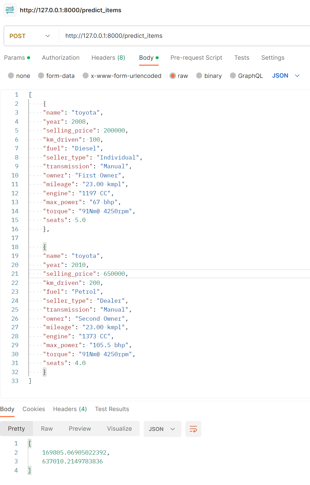

# Прогнозирование стоимости автомобиля с помощью регрессий

## Что было сделано/с какими результатами (2 уровень меню)
### Предобработка данных
- Очистка трейн датасета от дубликатов
- Преобразование признаков mileage, engine, max_power из строки во float
- Удаление признаков torque и name
- Заполнены пропуски медианами по фичам с трейна
- Признаки seats, engine преобразованы в int
### Визуализация данных
- Графики попарных распределениий числовых признаков на трейне
    - Выявлен характер связей между предикторами и целевой переменной
- Тепловая карта попарных корреляций между числовыми признаками
    - Найдены наиболее скоррелированные фичи друг с другом и с таргетом
- Графики распределения плотности вероятностей по числовым признакам на треине и тесте
    - У признаков на трейне заметна более высокая дисперсия
### Эксперименты по обучению различных моделей
- Гиперпараметры описываемых снизу моделей подбирались с помощью GridSearchCV
- Построены модели только на вещественных признаках и оценены с помощью R2 и MSE
    - Без регуляризации
    - С l1 регуляризацией (lasso)
    - С l1 и l2 регуляризацией (elasticnet)
- Построена модель на числовых и закодированных с помощью ohe категориальных признаках и оценена с помощью R2 и MSE
    - Обнаружен прирост качества и по R2 и по MSE по сравнению с моделями только на числовых признаках
### Попытки по улучшению работы модели (feature engineering)
- Для вещественных признаков добавлены полиномы до 3 степени
- На трейне произведена частичная очистка от выбросов (выбросов удалил очень мало, тк при попытках удалять выбросы в разных фичах ошибка на трейне сильно уменьшалась, но на тесте наоборот возростала)
- Оценка распределения таргета на трейне и теста с помощью гистограмм
    - На тесте среднее по таргету смещено в большую сторону относительно трейна за счет большего числа выбросов
- Оценена бизнес метрика на тестовой выборке (доля предиктов, отличающихся от реальных цен на эти авто не более чем на 10% (в одну или другую сторону))
    - 0.237
- Сохранена лучшая модель, ее веса, скейлер и объект для создания полиномиальных фичей в отдельный pickle файл
- Реализован сервис на FastApi
    - Получение стоимости машины в формате float по json файлу с признаковым описанием объекта
    - Получение списка стоимостей машин в формате float по списку json файлов с признаковыми описаниями объектов

 
## Что дало наибольший буст в качестве
Наибольший буст в качестве произошел после добавления полиномов с учетом удаления некоторых выбросов и использования модели с l2 регуляризацией

## Что сделать не вышло и почему
Можно было бы провести больше различных экспериментов по части feature engineering (заменять пропуски в фичах иначе, поэкспериментировать с кросс-фичами, спарсить доп данных)

Все доп эксперименты упираются в нехватку свободного времени

## Примеры работы сервиса по инференсу модели
### Predict item (возвращаем цену 1 объекта)

### Predict items (возвращаем список цен n объектов)

